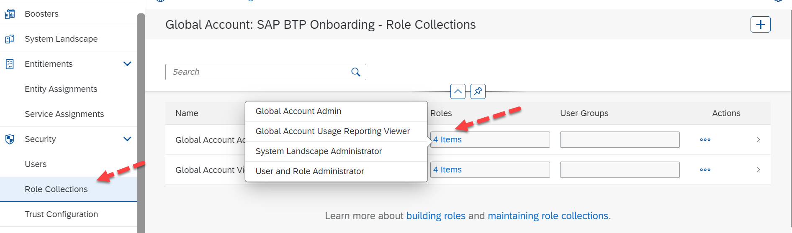

## Understanding the Roles and Role Collections 

**Roles** 

Users require authorizations to perform tasks within SAP BTP. Service-specific roles show up in your SAP BTP cockpit for assignment after a service is activated. For example, activating SAP Business Application Studio, Workzone, Build Services, etc. will make the subsequent access roles available.  

**Role Collections** 

Role Collections are one or a group of roles that can be created from scratch or copied that are created by the SAP BTP Services. These role collections help to group roles and assign them to users easily. Similar role collections are created for both the roles of Global Account Administrator and Global Account Viewer.  

First, let us look at the Global Roles created by default while provisioning your Global Account. Navigate to **Security** -> click on **Role Collections**.

 

 
 

 

Image 1</b> 

For a Global Account Administrator there are [4 different Roles](https://help.sap.com/docs/btp/sap-business-technology-platform/role-collections-and-roles-in-global-accounts-directories-and-subaccounts?q=System%20Landscape%20Administrator%20) have been grouped: 

