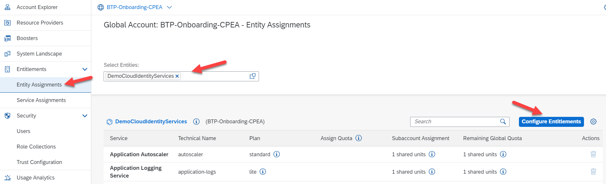
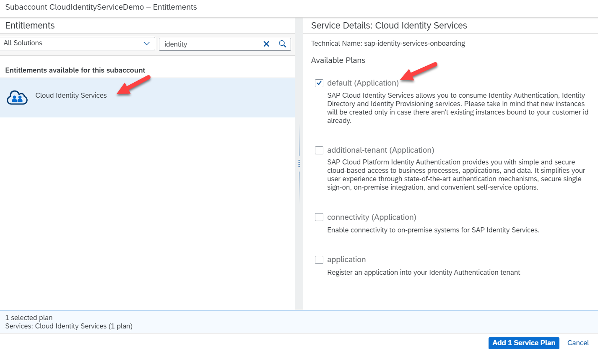

## Activate your SAP Cloud Identity Services 

In the previous sections, we looked at the SAP ID Services and Default Identity Providers. Now we will focus on activating your Custom Identity Provider which is your SAP Cloud Identity Services to get access to IAS and IPS.  

### Getting started:

- To activate your Cloud Identity Services on SAP BTP, we need a subaccount to be created. SAP Cloud Identity Services runs on several underlying Infrastructure-as-a-service technologies and regions and can be activated on our cloud partner service providers such as AWS (Amazon Web Services), Microsoft Azure, or GCP (Google Cloud Platform). You may refer to [Regional Availability](https://help.sap.com/docs/identity-authentication/identity-authentication/regional-availability?q=data%20center) before you choose/create your subaccount  

- Log in to your SAP BTP Global Account, click on the Create Button, and select Subaccount. Enter the required details as shown in image 2 and click on Create 

- Once your subaccount is created, assign the required entitlements. To do this, click the **Entitlements** -> click on **Entity Assignments** -> select your **subaccount in my case, DemoCloudIdentityService**

 

 
 

 

Image 1</b> 

Click on **Configure Entitlements**, and then click on **Add Service Plans**, a new window should pop up. Select the service SAP Cloud Identity Services, choose the service **Default (Application)** click on **Add 1 Service Plan**, and then **Save** the service plan.  

The **default** plan would be the first option to select since we are creating the service for the first time and the **additional tenant** is used while you are creating additional services for your BTP Cockpit. Choose the other services as required. 

 

 
 

 

Image 2</b> 

- Navigate to your SAP Subaccount DemoCloudIdentityService -> click on Services -> click on Service Marketplace -> click on SAP Cloud Identity Services and click on Create 
