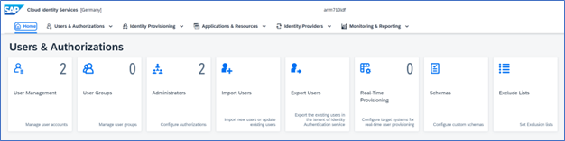

## 1. Users and Authorizations  

Now that your tenant has been properly provisioned initial access is designated to one user as the tenant administrator. Due to security reasons, it is this person’s exclusive responsibility to add additional administrators to the tenant. As a best practice, SAP recommends always having at least two administrators defined. 

Administrators 

Login to your Cloud Identity Services tenant https://<tenant ID>.accounts.ondemand.com/admin  

In the Users & Authorizations Section, select the Administrators tile

 

 
 

 

Image 1</b> 

 You can add Administrators or Systems and assign the following Authorization Roles: 

 | Authorization	| Description | User | System |
| --- | --- |--- |--- |
| `Manage Applications` | Configure applications via the admin console. | X | X |
| `Manage Corporate Identity providers` | Configure the identity providers via the admin console.  | X | X |
| `Manage Users` | Manage, import, and export users via the admin console.  | X | X |
| `Read Users` | Retrieve user data and import users via the admin console and SCIM REST API of identity authentication. | X | X |
| `Manage Groups ` | Create, edit, and delete user groups via the admin console.  | X | X |
| `Manage Tenant Configuration` | Manage tenant configuration and authorization assignment to users. | X | X |
| `Manage Identity Provisioning` | Configure identity provisioning. This authorization grants the main IPS_ADMIN role.  | X | |
| `Access Proxy System API` | Permission to access API for provisioning identities via proxy systems. | | X |
| `Access Real-Time Provisioning API` | Permission to access API for real-time provisioning of identities.  | | X |
