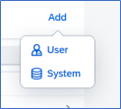
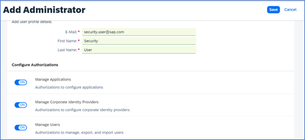

  ## 1. Users and Authorizations  

Now that your tenant has been properly provisioned initial access is designated to one user as the tenant administrator. Due to security reasons, it is this person’s exclusive responsibility to add additional administrators to the tenant. As a best practice, SAP recommends always having at least two administrators defined. 

Administrators 

Login to your Cloud Identity Services tenant https://<tenant ID>.accounts.ondemand.com/admin  

In the Users & Authorizations Section, select the Administrators tile

 

 
 

 

Image 1</b> 

 You can add Administrators or Systems and assign the following Authorization Roles: 

 | Authorization	| Description | User | System |
| --- | --- |--- |--- |
| `Manage Applications` | Configure applications via the admin console. | X | X |
| `Manage Corporate Identity providers` | Configure the identity providers via the admin console.  | X | X |
| `Manage Users` | Manage, import, and export users via the admin console.  | X | X |
| `Read Users` | Retrieve user data and import users via the admin console and SCIM REST API of identity authentication. | X | X |
| `Manage Groups ` | Create, edit, and delete user groups via the admin console.  | X | X |
| `Manage Tenant Configuration` | Manage tenant configuration and authorization assignment to users. | X | X |
| `Manage Identity Provisioning` | Configure identity provisioning. This authorization grants the main IPS_ADMIN role.  | X | |
| `Access Proxy System API` | Permission to access API for provisioning identities via proxy systems. | | X |
| `Access Real-Time Provisioning API` | Permission to access API for real-time provisioning of identities.  | | X |
| `Access Identity provisioning Tenant Admin API` | Permission to access tenant API for running provisioning jobs.  | | X |

**Add a User:**

- Add > User
  
 

 
 

 

Image 2</b> 

- Enter an **Email address**, **First Name**, and **Last Name** > Select **Roles** > **Save**  

 

 
 

 

Image 3</b> 

**Add a System: **

A system can also be added as an administrator in the administration console. This system can receive the same roles and perform the same actions as a human administrator. Note: the system name initially entered cannot be changed after it is created and help you **manage/set up trust** with Identity Authentication.  

- Add > **System**

 

 
 

 

Image 4</b> 

- Enter a system name 
- Select the required Roles 
- Configure the authentication method (either Certificate or Secret) > Save your entries

 

 
 

 

Image 5</b> 

For more information on Adding Administrators see the [SAP Help Documentation](https://help.sap.com/docs/identity-authentication/identity-authentication/add-administrators).  

**To delete an Administrative User or System in SAP IAS (Identity Authentication Services)**  

- Select the user or system and remove all their Authorizations 
- Once the authorizations are completely removed the user or system will automatically be removed from the list.  
- Reference [SAP KBA (Knowledge Base Articles) 3275785](https://me.sap.com/notes/0003275785)

**User Management**  

Tenant administrators are responsible for managing user accounts via the administration console for SAP Cloud Identity Services.  

**Types of users **

|  |  |
| --- | --- |
| Customer | External users that are customers of the company |
| Employee | Internal company users, mainly users with long-term contracts |
| Partner | External users from a partner company |
| Public | External users that are not controlled by the company |	
| External | External users can be temporary hired employees or need access to learning and training materials. |
| Onboardee | An employee user that needs a different authentication because for example, the user might not exist in the corporate identity provider. |

