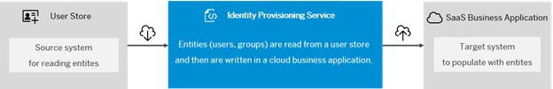

## Learn About Identity Provisioning  

The identity provisioning service ensures the synchronization of entities (users, groups, roles) between a source system and one or more target systems, essentially automating identity lifecycle processes. It also supports the use of proxy systems for indirect connections between a system supported by Identity provisioning and an external application that uses SCIM 2.0 API to consume identities from the proxy system. 

 

 
 

 

Image 1</b> 

