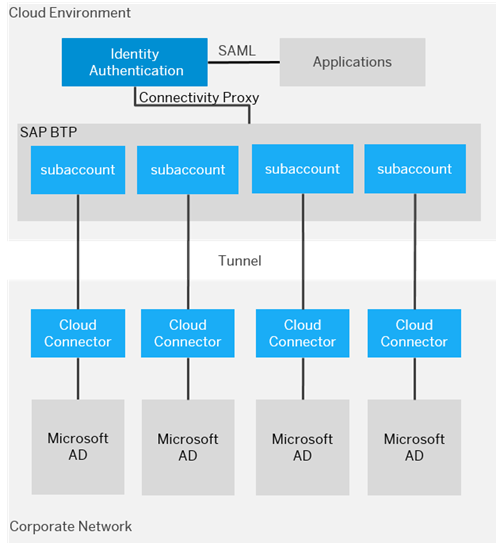

## Learn about Identity Providers  

SAP provides **SAP Identity Authentication, SAP ID Services, and Bring Your Own Identity Provider** options as the identity provider for authentication and single sign-on for users in the cloud. This service provides customers with controlled cloud-based access to business processes, applications, and data thereby simplifying the user experience. SAP understands that companies may have other preferred scenarios for users to log in to applications, for example, social identity providers, integration with existing customer landscapes, or external source systems. In this section of the mission, we will explore all the options in detail.  

**Corporate Identity Providers**  

SAP Identity Authentication can be integrated with existing customer landscapes and supports several types of delegated authentication, including corporate user store, Kerberos authentication, and identity provider proxy.  

**Corporate User Store**  

Integration between Identity Authentication and the corporate user store allows users to authenticate with their corporate credentials from the corporate user store without the need to use another set of credentials for their cloud access. Depending on your SAP BTP environment you can configure this option in two ways: 

- Cloud Foundry Environment - **Recommended approach 
  - Identity Authentication can connect with Microsoft Active Directory corporate user store via the connectivity proxy component and the SAP Cloud Connector.  
  - [Configure a corporate user store with SAP IAS in the Cloud Foundry Environment](https://help.sap.com/docs/identity-authentication/identity-authentication/corporate-user-store-cloud-foundry-environment#loio9942ede4fae84934a8eb184a0015c305)

 

 
 

 

Image 1</b> 

